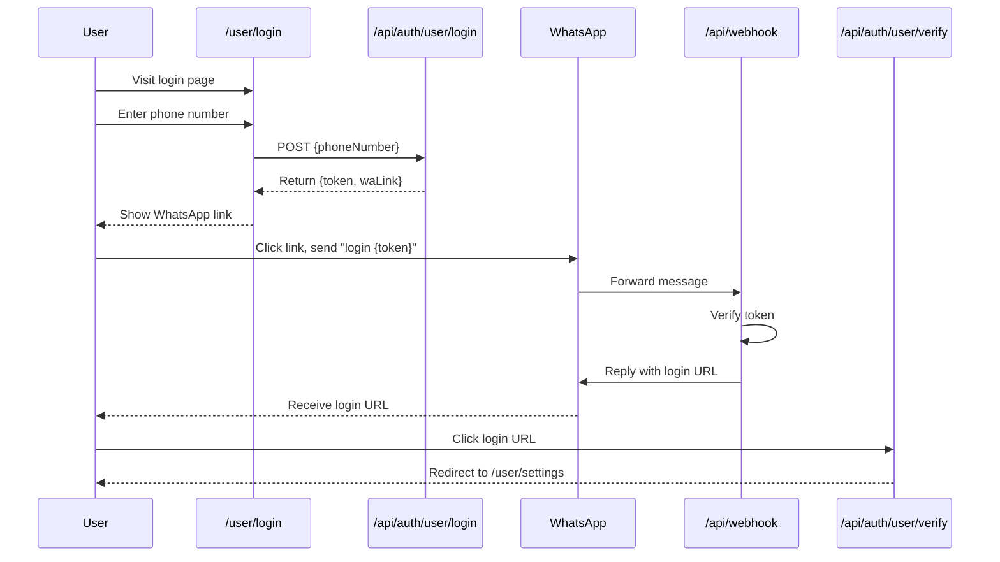
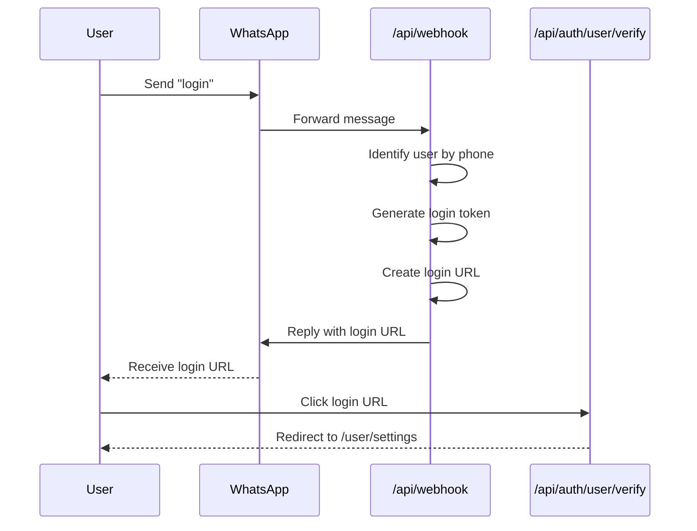

# Simplified WhatsApp Login Flow

## Overview
This plan simplifies the user login flow by allowing users to send a simple "login" command via WhatsApp and receive a verified login link directly, without needing to visit the login page first.

## Current Flow vs. New Flow

### Current Flow (Multi-step)


### New Simplified Flow (Direct)


## Implementation Plan

### 1. Update Webhook Handler

**File: `app/api/webhook/route.ts`**

Add a new handler for simple "login" command before the existing token-based login handler:

```typescript
// Add this BEFORE the existing login token handler (line 89)
// Check for simple "login" command
if (rawMessage.toLowerCase().trim() === 'login') {
  console.log(`🔐 [WEBHOOK] Simple login command detected`);
  
  // Generate login token
  const token = crypto.randomBytes(3).toString('hex').toUpperCase();
  const tokenExpires = new Date(Date.now() + 5 * 60 * 1000); // 5 minutes
  
  // Save token to user record
  await prisma.user.update({
    where: { id: user.id },
    data: {
      loginToken: token,
      loginTokenExpires: tokenExpires,
    },
  });
  
  // Generate login URL
  const baseUrl = process.env.NEXTAUTH_URL || request.nextUrl.origin;
  const loginUrl = `${baseUrl}/api/auth/user/verify?token=${token}`;
  
  console.log(`✅ [WEBHOOK] Login token generated: ${token}`);
  
  // Send CTA button message via WhatsApp
  console.log(`📱 [WEBHOOK] Sending login link to ${phoneNumber}...`);
  try {
    await sendWhatsAppCTAButton(
      phoneNumber,
      "🔑 Link Login",
      `Halo ${userName}! Berikut adalah link login Anda. Link ini berlaku selama 5 menit.`,
      "🚀 Login Sekarang",
      loginUrl
    );
    console.log(`✅ [WEBHOOK] Login link sent successfully`);
    
    // Send success reaction
    try {
      await sendWhatsAppReaction(phoneNumber, message.id, "✅");
      console.log(`✅ [WEBHOOK] Success reaction sent`);
    } catch (reactionError) {
      console.error("⚠️  [WEBHOOK] Failed to send success reaction:", reactionError);
    }
  } catch (waError) {
    console.error("❌ [WEBHOOK] WhatsApp send error:", waError);
  }
  
  return NextResponse.json({ status: "login_sent" }, { status: 200 });
}
```

**Location:** Insert this code block after line 88 (after user auto-registration) and before line 89 (existing login token handler).

### 2. Update Login Page UI

**File: `app/user/login/page.tsx`**

Update the login page to inform users about the simplified login option:

```typescript
// Add this section before the form
<div className="bg-blue-50 border border-blue-200 rounded-lg p-4 mb-6">
  <h3 className="font-semibold text-blue-800 mb-2">🚀 Cara Cepat Login</h3>
  <p className="text-blue-700 text-sm mb-2">
    Cukup kirim pesan <strong>"login"</strong> ke WhatsApp kami, dan Anda akan menerima link login langsung!
  </p>
  <p className="text-blue-600 text-xs">
    Tidak perlu mengisi form di bawah ini jika Anda ingin cara yang lebih cepat.
  </p>
</div>
```

**Location:** Insert this after the page header and before the phone input form.

### 3. Update Login Page Instructions

**File: `app/user/login/page.tsx`**

Update the instructions section to reflect both login methods:

```typescript
<div className="text-center mb-8">
  <h2 className="text-2xl font-bold text-gray-900 mb-2">
    Login via WhatsApp
  </h2>
  <p className="text-gray-600">
    Pilih salah satu cara login di bawah ini
  </p>
</div>

// Option 1: Quick Login via WhatsApp
<div className="bg-gradient-to-r from-green-50 to-emerald-50 border border-green-200 rounded-xl p-6 mb-6">
  <div className="flex items-start gap-4">
    <div className="flex-shrink-0 w-12 h-12 bg-green-500 rounded-full flex items-center justify-center">
      <span className="text-white text-2xl">⚡</span>
    </div>
    <div className="flex-1">
      <h3 className="text-lg font-semibold text-green-800 mb-2">
        Cara Cepat (Disarankan)
      </h3>
      <ol className="text-green-700 text-sm space-y-1">
        <li>1. Buka WhatsApp</li>
        <li>2. Kirim pesan: <code className="bg-green-100 px-2 py-1 rounded">login</code></li>
        <li>3. Terima link login via WhatsApp</li>
        <li>4. Klik link untuk masuk</li>
      </ol>
    </div>
  </div>
</div>

// Option 2: Traditional Login (existing form)
<div className="bg-white border border-gray-200 rounded-xl p-6">
  <div className="flex items-start gap-4">
    <div className="flex-shrink-0 w-12 h-12 bg-gray-500 rounded-full flex items-center justify-center">
      <span className="text-white text-2xl">📱</span>
    </div>
    <div className="flex-1">
      <h3 className="text-lg font-semibold text-gray-800 mb-2">
        Cara Tradisional
      </h3>
      <p className="text-gray-600 text-sm mb-4">
        Masukkan nomor WhatsApp Anda untuk mendapatkan token login
      </p>
      // Existing form goes here...
    </div>
  </div>
</div>
```

### 4. Update README Documentation

**File: `README.md`**

Add a new section documenting the simplified login flow:

```markdown
## User Login via WhatsApp

### Quick Login (Recommended)

Users can login quickly by sending a simple message:

1. Open WhatsApp
2. Send message: `login`
3. Receive login link via WhatsApp
4. Click the link to access your account

The login link is valid for 5 minutes and can only be used once.

### Traditional Login

Users can also login through the web interface:

1. Visit `/user/login`
2. Enter your WhatsApp number
3. Receive a 6-character token
4. Send `login {token}` via WhatsApp
5. Receive login link via WhatsApp
6. Click the link to access your account
```

## Security Considerations

1. **Token Expiration**: Login tokens expire after 5 minutes
2. **Single Use**: Tokens are invalidated after successful login
3. **Phone Number Verification**: User identity is verified through WhatsApp's phone number
4. **Secure Session**: JWT tokens are used for session management
5. **HTTPS Required**: All login URLs should use HTTPS in production

## Benefits of Simplified Flow

1. **Faster Login**: Users can login in 2 steps instead of 5
2. **Better UX**: No need to visit login page first
3. **Mobile-Friendly**: Works entirely within WhatsApp
4. **Reduced Friction**: Users don't need to copy tokens
5. **Backward Compatible**: Traditional login method still works

## Testing Checklist

- [ ] User can send "login" command via WhatsApp
- [ ] Webhook recognizes simple "login" command
- [ ] System generates login token automatically
- [ ] User receives login URL via WhatsApp CTA button
- [ ] Login URL is valid and redirects correctly
- [ ] Session is created successfully
- [ ] User is redirected to /user/settings
- [ ] Token expiration works (5 minutes)
- [ ] Token is invalidated after use
- [ ] Existing "login {token}" flow still works
- [ ] Login page shows both options
- [ ] Error handling works for invalid tokens

## Migration Notes

- No database changes required
- Existing users can use either login method
- New users will prefer the simplified flow
- Consider deprecating the traditional flow in the future if adoption is high
