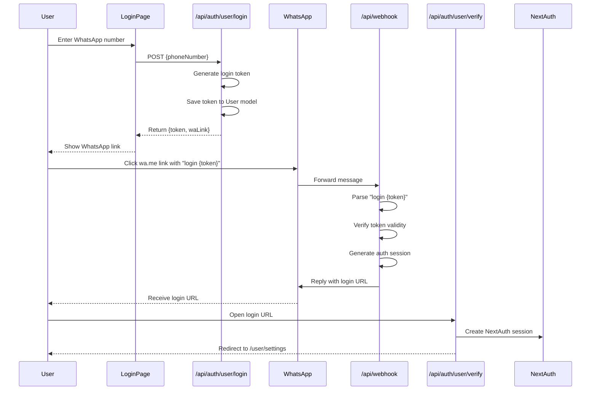
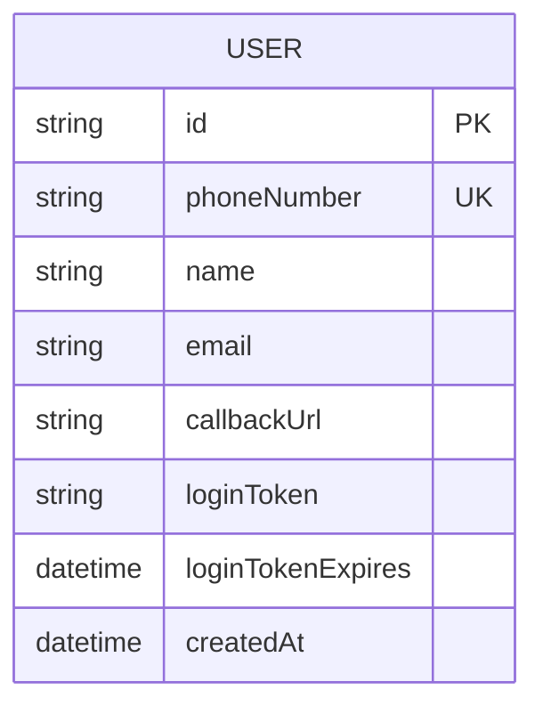

# User Login and Settings Page Implementation Plan

## Overview
This plan implements a WhatsApp-based login system for users and a settings page where users can configure their webhook callback URL. The design focuses on mobile-first user experience.

## System Architecture

### Login Flow Diagram



### Database Schema Changes



## Implementation Details

### 1. Database Schema Changes

**File: `prisma/schema.prisma`**

Add the following fields to the `User` model:

```prisma
model User {
  id                String     @id @default(uuid())
  phoneNumber       String     @unique
  name              String
  email             String?    @unique
  callbackUrl       String?    // New: User's webhook callback URL
  loginToken        String?    // New: Temporary login token
  loginTokenExpires DateTime?  // New: Token expiration time
  createdAt         DateTime   @default(now())
  transactions      Transaction[]
  chatLogs          ChatLog[]

  @@map("users")
}
```

### 2. User Authentication System

#### 2.1 Update NextAuth Configuration

**File: `lib/auth.ts`**

Add a new authentication strategy for users (separate from admin credentials):

```typescript
// Add to existing NextAuth config
// Users will authenticate via WhatsApp token verification
// The session will be created when the user clicks the login link sent via WhatsApp
```

#### 2.2 Login Token Generation API

**File: `app/api/auth/user/login/route.ts`**

Create endpoint to generate login token:

```typescript
// POST /api/auth/user/login
// Request body: { phoneNumber: string }
// Response: { 
//   token: string, 
//   waLink: string, 
//   expiresIn: number 
// }
```

Logic:
1. Validate phone number format
2. Find or create user
3. Generate random 6-character token
4. Save token and expiration (5 minutes) to user record
5. Return token and WhatsApp link

#### 2.3 Webhook Login Handler

**File: `app/api/webhook/route.ts`**

Modify webhook to handle login commands:

```typescript
// Add login command handler before AI processing
// Check if message starts with "login "
// Extract token and verify against user record
// If valid, generate NextAuth session and create login URL
// Reply with login URL via WhatsApp
```

#### 2.4 Token Verification API

**File: `app/api/auth/user/verify/route.ts`**

Create endpoint to verify login token and create session:

```typescript
// GET /api/auth/user/verify?token=xxx
// Verify token, create NextAuth session, redirect to /user/settings
```

### 3. User Pages (Mobile-First Design)

#### 3.1 User Login Page

**File: `app/user/login/page.tsx`**

Mobile-first design with:
- Clean, centered layout
- Large input field for phone number
- Clear call-to-action button
- WhatsApp link display
- Loading states
- Error handling

#### 3.2 User Settings Page

**File: `app/user/settings/page.tsx`**

Mobile-first design with:
- Header with user info
- Callback URL input field
- Save button
- Current callback URL display
- Help/instructions section
- Mobile navigation (bottom tab or hamburger menu)

#### 3.3 Mobile UI Components

**Files to create:**
- `components/user/MobileHeader.tsx`
- `components/user/SettingsForm.tsx`
- `components/user/LoadingSpinner.tsx`

### 4. User Settings API

#### 4.1 Get Settings API

**File: `app/api/user/settings/route.ts`**

```typescript
// GET /api/user/settings
// Returns: { callbackUrl: string }
```

#### 4.2 Update Settings API

**File: `app/api/user/settings/route.ts`**

```typescript
// PATCH /api/user/settings
// Request body: { callbackUrl: string }
// Validates URL format
// Updates user record
// Returns: { success: true, callbackUrl: string }
```

### 5. Middleware Updates

**File: `middleware.ts`**

Add user route protection:

```typescript
const isUserRoute = nextUrl.pathname.startsWith("/user");
const isUserLoginPage = nextUrl.pathname === "/user/login";

if (isUserRoute && !isUserLoginPage && !isLoggedIn) {
  return NextResponse.redirect(new URL("/user/login", nextUrl));
}

if (isUserLoginPage && isLoggedIn) {
  return NextResponse.redirect(new URL("/user/settings", nextUrl));
}
```

### 6. Environment Variables

**File: `.env.example`**

Add:
```
# System WhatsApp Number (for receiving login messages)
WA_SYSTEM_PHONE_NUMBER="6281234567890"
```

## Security Considerations

1. **Token Expiration**: Login tokens expire after 5 minutes
2. **Single Use**: Tokens are invalidated after successful login
3. **Rate Limiting**: Limit login token generation per phone number
4. **URL Validation**: Validate callback URLs to prevent malicious redirects
5. **HTTPS Only**: Require HTTPS in production for all user routes

## Mobile-First Design Principles

1. **Touch-Friendly**: Minimum 44px tap targets
2. **Responsive**: Works on all screen sizes (320px+)
3. **Fast Loading**: Optimize images and minimize JavaScript
4. **Clear CTAs**: Single primary action per screen
5. **Readable Text**: Minimum 16px font size for body text
6. **Thumb Zone**: Place important elements in easy-to-reach areas

## File Structure

```
app/
├── user/
│   ├── login/
│   │   └── page.tsx
│   ├── settings/
│   │   └── page.tsx
│   └── layout.tsx
├── api/
│   ├── auth/
│   │   └── user/
│   │       ├── login/
│   │       │   └── route.ts
│   │       └── verify/
│   │           └── route.ts
│   └── user/
│       └── settings/
│           └── route.ts
components/
└── user/
    ├── MobileHeader.tsx
    ├── SettingsForm.tsx
    └── LoadingSpinner.tsx
```

## Testing Checklist

- [ ] User can enter phone number and receive login token
- [ ] WhatsApp link opens correctly with token
- [ ] Webhook processes login command
- [ ] User receives login URL via WhatsApp
- [ ] Clicking login URL creates session and redirects
- [ ] User can access settings page after login
- [ ] User can update callback URL
- [ ] Callback URL validation works
- [ ] Session persists across page reloads
- [ ] Mobile layout works correctly on various screen sizes
- [ ] Error handling works for invalid tokens
- [ ] Token expiration works correctly

## Future Enhancements

1. Add user dashboard to view transaction history
2. Add logout functionality
3. Add profile editing (name, email)
4. Add push notifications for new transactions
5. Add multiple callback URLs support
6. Add webhook event filtering
7. Add transaction analytics for users
